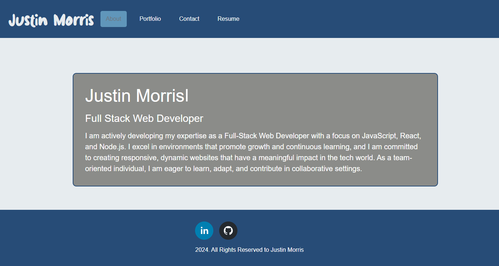
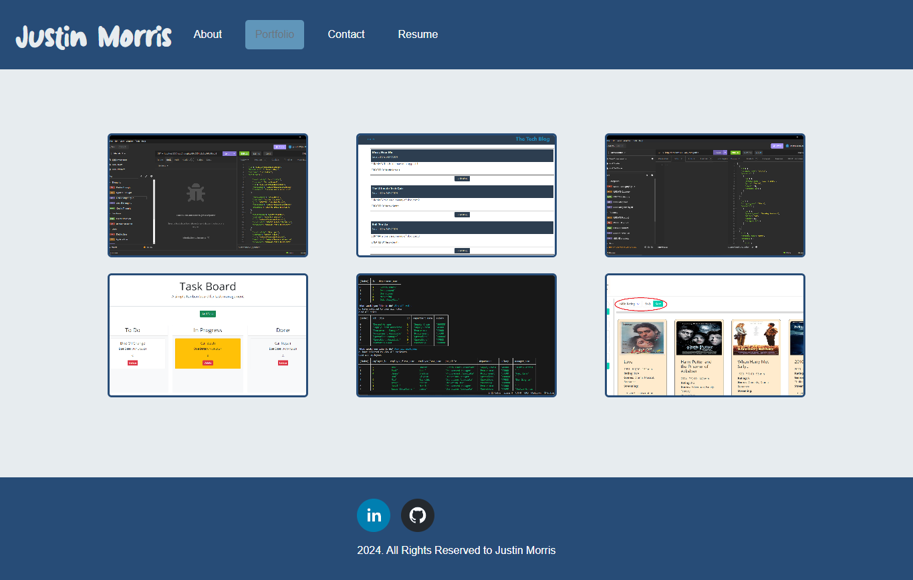
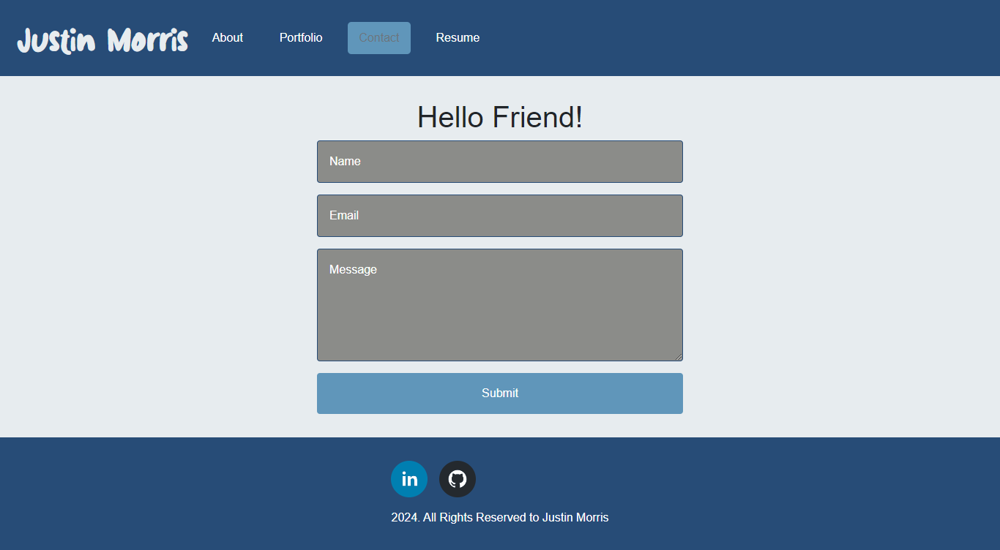

# Module-20-Portfolio-Using-React.js
My Professional Portfolio using React.js and Node.js

## Description
This is my Professional Portfolio React Web Application, Node.js as backend.

## Live App Link
[Live Link](https://66b8dd3718f5a5790c87ccc2--unrivaled-squirrel-34ea58.netlify.app/)

## User Story
AS AN employer looking for candidates with experience building single-page applications
 
I WANT to view a potential employee's deployed React portfolio of work samples
 
SO THAT I can assess whether they're a good candidate for an open position

## Installation

 Install the following:
  
 npm install

 ## Preview
 

 

 

 ## License

 

 This project is licensed under the [MIT License](https://choosealicense.com/licenses/mit/) license.

 ## Contributing

 Pull requests are most welcome

 ## Queries

 GitHub: https://github.com/jmorris38

 Email: jmorris38@outlook.com
